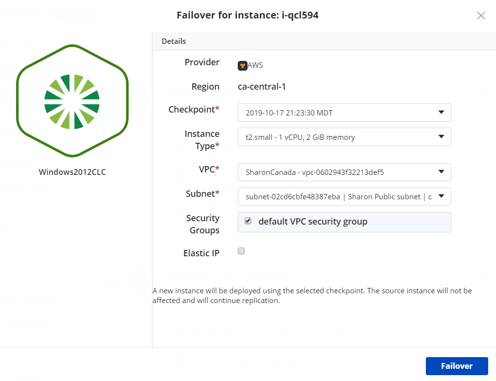
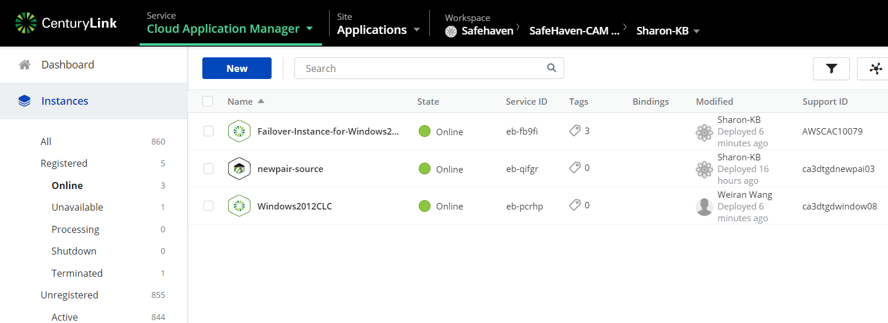

{{{
  "title": "Failover Operation",
  "date": "09-26-2019",
  "author": "Sharon Wang",
  "attachments": [],
  "contentIsHTML": false
}}}

**In this article:**

* [Overview](#overview)
* [Audience](#audience)
* [Prerequisites](#prerequisites)
* [Failover](#failover)

### Overview 

This article is meant to assist users of Cloud Application Manager willing to use Disaster Recovery feature, trying to initiate Failover operation.

### Audience

All users of Cloud Application Manager who wants to use Disaster Recovery feature and initiate Failover operation.

### Prerequisites

* The production server is protected and 100% synced

### Failover 
1. Navigate to the production windows server. Make sure BECR is running and you have last checkpoint taken, click on **Test Failover**

3. Fill in the detailed information of Test Failover instance:
 a. Choose a desired checkpoint
 b. Choose the **Instance Type**
 c. Choose the **VPC**
 d. Choose the **subnet**
 e. Choose a **Security Group**
 e. Click on ** Failover**

4. Once the Recovery server is deployed, you will be able to see the Failover instance on Instances tab

If you have additional questions, please [contact CLoud Application Manager Support](mailto:incident@CenturyLink.com)
