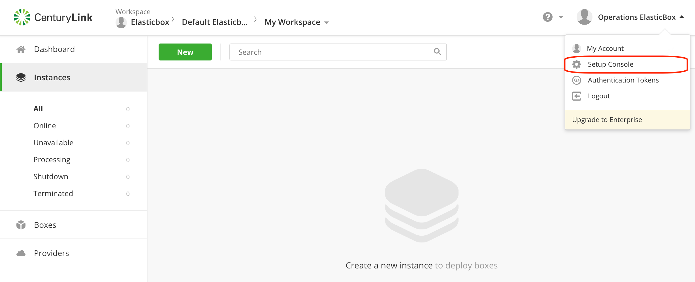
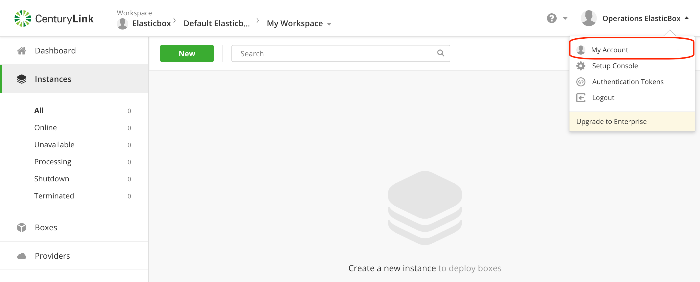
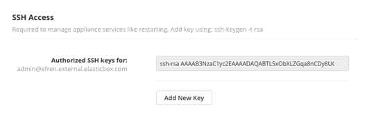
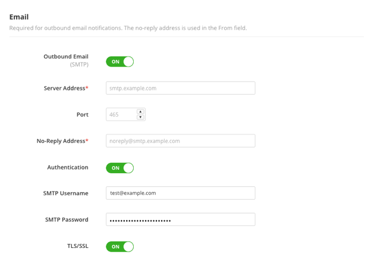

{{{
"title": "Setting Up Cloud Application Manager Dedicated Edition for Use",
"date": "03-25-2020",
"author": "Diego Sanjuan and Guillermo Sanchez",
"keywords": ["cam", "cloud application manager", "Data Center edition", "appliance", "setup", "ssh", "key", "smtp", "ntp", "password", "dedicated", "cam-d"],
"attachments": [],
"contentIsHTML": false
}}}

**In this article:**

* [Overview](#overview)
* [Audience](#audience)
* [Prerequisites](#prerequisites)
* [Initial Cloud Application Manager Dedicated Edition Setup](#initial-cloud-application-manager-dedicated-edition-setup)
* [Changing the Cloud Application Manager Dedicated Edition Hostname](#changing-the-cloud-application-manager-dedicated-edition-hostname)
* [Changing Cloud Application Manager Dedicated Edition Admin Account Password](#changing-cloud-application-manager-dedicated-edition-admin-account-password)
* [Adding Your SSH Key (Optional)](#adding-your-ssh-key-optional)
* [Changing NTP Time Zone (Optional)](#changing-ntp-time-zone-optional)
* [Enabling SMTP Outbound Email (Optional)](#enabling-smtp-outbound-email-optional)
* [Switching Cloud Application Manager Dedicated Edition Device Root Storage](#switching-cloud-application-manager-dedicated-edition-device-root-storage)
* [Contacting Cloud Application Manager Support](#contacting-cloud-application-manager-support)

### Overview

This article documents the initial setup of Cloud Application Manager Dedicated Edition (referred to as 'appliance'). This covers installation of the appliance and setting it up for others in your organization to use.

You can then assign a [user-friendly hostname](#changing-the-cloud-application-manager-dedicated-edition-hostname) (vanity URL) to point users wishing to access the appliance. Upon completion, *optional settings* allow you to configure [SSH keys](#adding-your-ssh-key-optional) for accessing the appliance, [time zone and NTP servers](#changing-ntp-time-zone-optional), [email notifications via SMTP](#enabling-smtp-outbound-email-optional), or using a [new device to store appliance and Cloud Application Manager data](#switching-cloud-application-manager-dedicated-edition-device-root-storage).

### Audience

All Cloud Application Manager users who want to deploy and do the initial setup of a Cloud Application Manager Dedicated Edition.

### Prerequisites

* Your Cloud Application Manager Dedicated Edition (appliance) should be properly deployed and running in your preferred platform. You can refer to the [Cloud Application Manager Dedicated Edition documentation](camd-overview.md).
* You need to have access to HTTPS (443) port of the appliance to access its setup console.

### Initial Cloud Application Manager Dedicated Edition Setup

#### Steps

1. Log in to Cloud Application Manager on the appliance

   * Get the Cloud Application Manager IP address of the appliance VM you deployed from your environment console.
   

   Log in to Cloud Application Manager with the default appliance admin credentials:
   * username: **admin@elasticbox.com**
   * password: elasticbox123

   

2. Set up Cloud Application Manager.

   From the menu drop-down at the top right, click **Setup Console**. From this page, you can manage settings for the appliance.
   

   * Change the hostname to a friendly URL.
   * Change the default admin account password.
   * Optionally, add SSH keys to manage access to the appliance virtual machine.
   * Optionally, change the NTP time zone, which affects the timestamp in the appliance logs.
   * Optionally, enable outbound for notifications.
   * Optionally, switch the appliance device storage to increase storage or processing speed.

3. Create a new admin account for your enterprise

   Cloud Application Manager provides a default appliance admin account, which gives full access to manage the appliance and administer Cloud Application Manager settings for your organization. This is like a master key, so use it only in case of emergency. To administer the appliance and Cloud Application Manager on a regular basis, create and use a fresh admin account.

   * Log out of Cloud Application Manager.
   * The login page will be displayed, otherwise open the Cloud Application Manager IP address shown in the appliance VM console in a web browser to access the login page.
   * Sign up for a new user account. This will serve as the new admin account.
   * Log back in as the appliance admin using the credentials in step 2, with the password that was set in step 3.
   * Add your new user account as an administrator in the Admin Console.
   * Going forward, use this admin account to manage the appliance and settings for your organization.

### Changing the Cloud Application Manager Dedicated Edition Hostname

Hostname is a user-friendly name to refer to the IP address of the Cloud Application Manager, for example, `yourcompany.com`. The IP address of the Cloud Application Manager referred to by the hostname is that of the virtual machine running the appliance.

To allow users to connect, also make sure your network firewall allows inbound traffic to the appliance IP address via TCP ports 443, 5671, and 5672.

#### Steps to change the hostname

1. Browse to Cloud Application Manager with the IP address in the appliance console and log in as an admin.
2. From the menu drop-down at the top right, click **Setup Console**.
3. Under Hostname, specify a valid IP or hostname that resolves to a valid IP address. Make sure that it’s a fully qualified domain name that meets the following criteria:

   * The appliance VM itself can access it.
   * Deployed instances can access it.
   * Users in the network can browse to the Cloud Application Manager UI.

4. When done, scroll down and click **Save Settings**.

**IMPORTANT:** When you change the hostname, any instances you launched previously can potentially become unavailable if the appliance obtains its IP address dynamically. To avoid this, set a static address for the appliance.

### Changing Cloud Application Manager Dedicated Edition Admin Account Password

Change the appliance admin account password to keep it secure.

From the Cloud Application Manager UI, click on the account dropdown, in the top right corner:

Click on change password link:

Specify the new password and confirm it:

### Adding Your SSH Key (Optional)

Allow SSH access to the appliance virtual machine for the appliance admin account. You can SSH into the appliance virtual machine only using the keys you add here. SSH access is helpful if you want to look at logs and such.

#### Steps to add your SSH key

1. Browse to Cloud Application Manager with the hostname address and log in as an admin to access the appliance console.
2. From the menu drop-down at the top right, click **Setup Console**.
3. Under SSH Access, click **Add New Key**.
4. If you don’t have one already, generate a key using `ssh-keygen -t rsa` and paste in the public key.
5. When done, scroll down and click **Save Settings**.

### Changing NTP Time Zone (Optional)

This shows the network time protocol (NTP) setting on the appliance. By default, it’s set to the time zone of the host running the appliance. You can optionally change the NTP server and time zone. The appliance uses this to determine the timestamp in logs.

#### Steps to change the NTP time zone

1. Browse to Cloud Application Manager with the hostname address and log in as an admin to access the appliance console.
2. From the menu drop-down at the top right, click **Setup Console**.
3. Under **Time**, specify the following settings.
4. When done, scroll down and click **Save Settings**.

| Setting | Description |
|---------|-------------|
| Primary   NTP Server | URL or IP address of the primary NTP server. |
| Secondary   NTP Server | *Optional*. URL or IP address of the secondary NTP server. |
| Time Zone | Appliance host system time zone. |

### Enabling SMTP Outbound Email (Optional)

We recommend that you specify SMTP server settings to be able to auto send outbound email notifications in Cloud Application Manager. The no-reply address is used in the From field. Under Email, click **ON** to enable outbound email.

#### Steps to enable SMTP Outbound Email

1. Browse to Cloud Application Manager with the hostname address and log in as an admin to access the appliance console.
2. From the menu drop-down at the top right, click **Setup Console**.
3. Under Email, specify these settings.
4. When done, click **Save Settings**.

| Setting | Description |
|---------|-------------|
| Server Address | Specify the hostname or IP address of the SMTP mail server, for example, smtp.example.com. |
| Port | Typically, you can specify 25 for SMTP and 465 for SMTPS. |
| No-Reply Address | Specify the email address to use in the sender address (or from) field of notification messages. |
| Authentication | Set to **ON** if your SMTP server requires authentication to send emails. |
| SMTP Username | Enter the full email address of a username, such as **username@example.com** used to authenticate with the SMTP server. |
| SMTP Password | Enter the password for the SMTP username. |
| TLS/SSL | Set to **ON** if emails are encrypted using TLS or SSL. |

### Switching Cloud Application Manager Dedicated Edition Device Root Storage

When you install the appliance, the appliance VM by default gets 100 GB of virtual disk space. For more storage or faster performance, attach a new disk to the VM and make that the primary appliance storage. Do this before you start using Cloud Application Manager.

#### Steps to switch device root storage

1. In vSphere vCenter, power off the appliance VM and attach a second virtual disk with more CPU, RAM, and disk space. For more information, see the [vCenter 5.0](http://pubs.vmware.com/vsphere-50/topic/com.vmware.ICbase/PDF/vsphere-esxi-vcenter-server-50-storage-guide.pdf) and [vCenter 5.5](http://pubs.vmware.com/vsphere-55/topic/com.vmware.ICbase/PDF/vsphere-esxi-vcenter-server-55-storage-guide.pdf) help.
2. Power on the appliance VM. In the appliance Setup Console, under Block Device, select the second disk as the primary appliance storage.

   

3. When done, click **Save Settings**.

When you switch the disk, the appliance reboots and becomes unavailable for a few minutes. In that time, it copies over existing data from the other disk like specific appliance settings, logs, the database, and the saved state of RabbitMQ. It also copies all the generated data to the second disk. When the appliance VM is back online, you can start using Cloud Application Manager.

### Contacting Cloud Application Manager Support

We’re sorry you’re having an issue in [Cloud Application Manager](https://www.ctl.io/cloud-application-manager/). Please review the [troubleshooting tips](../Troubleshooting/troubleshooting-tips.md), or contact [Cloud Application Manager support](mailto:incident@CenturyLink.com) with details and screenshots where possible.

For issues related to API calls, send the request body along with details related to the issue.

In the case of a box error, share the box in the workspace that your organization and Cloud Application Manager can access and attach the logs.

* Linux: SSH and locate the log at /var/log/elasticbox/elasticbox-agent.log
* Windows: RDP into the instance to locate the log at C:\ProgramData\ElasticBox\Logs\elasticbox-agent.log
