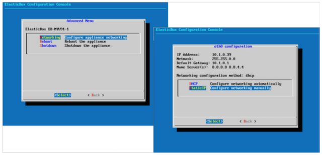

{{{
"title": "Configuring Network Settings of Cloud Application Manager Dedicated Edition",
"date": "03-25-2020",
"author": "Diego Sanjuan and Guillermo Sanchez",
"keywords": ["cam", "cloud application manager", "Data Center edition", "appliance", "setup", "network", "dedicated", "cam-d"],
"attachments": [],
"contentIsHTML": false
}}}

**In this article:**

* [Overview](#overview)
* [Audience](#audience)
* [Prerequisites](#prerequisites)
* [Steps to configure network settings](#steps-to-configure-network-settings)
* [Contacting Cloud Application Manager Support](#contacting-cloud-application-manager-support)

### Overview

This article shows how to configure Cloud Application Manager Dedicated Edition (the appliance) to connect to the network, once it's up and running. By default, it tries to get a dynamic IP address via DHCP. However, it is recommended to set a static IP address with the following steps so that Cloud Application Manager services are always available at the same IP address to users.

### Audience

All Cloud Application Manager Dedicated Edition users who wants to configure Cloud Application Manager Dedicated Edition (appliance) static IP address.

### Prerequisites

* Your Cloud Application Manager Dedicated Edition (appliance) should be properly deployed and running in your preffered platform. You can refer to the [Cloud Application Manager Dedicated Edition documentation](camd-overview.md).
* You need to have access to HTTPS (443) port of the appliance to access its setup console.

### Steps to configure network settings

* Open the VM serial console where you installed the appliance from the vCenter Client or OpenStack console, or directly through the tty console port.

  

* In the Advanced Menu, select **Networking > Static IP**.
  
  

* Enter settings based on your network configuration to set up a static IP address for the appliance. When done, click **Apply**.
  
  

  * **IP Address** - Unique IPv4 address the appliance needs to connect to the network.
  * **Netmask** - Subnet mask or address of nearest local area network, for example, 255.255.255.0.
  * **Default Gateway** - Enter the subnet router’s IP address. This is similar to the IP address, except for the last digit.
  * **Name Server** -  Enter the preferred and alternate DNS servers addresses on each name server field.

* Reboot the appliance to apply the configuration changes. In the appliance console, click **Advanced Menu > Reboot**.

### Contacting Cloud Application Manager Support

We’re sorry you’re having an issue in [Cloud Application Manager](https://www.ctl.io/cloud-application-manager/). Please review the [troubleshooting tips](../Troubleshooting/troubleshooting-tips.md), or contact [Cloud Application Manager support](mailto:incident@CenturyLink.com) with details and screenshots where possible.

For issues related to API calls, send the request body along with details related to the issue.

In the case of a box error, share the box in the workspace that your organization and Cloud Application Manager can access and attach the logs.

* Linux: SSH and locate the log at /var/log/elasticbox/elasticbox-agent.log
* Windows: RDP into the instance to locate the log at C:\ProgramData\ElasticBox\Logs\elasticbox-agent.log
