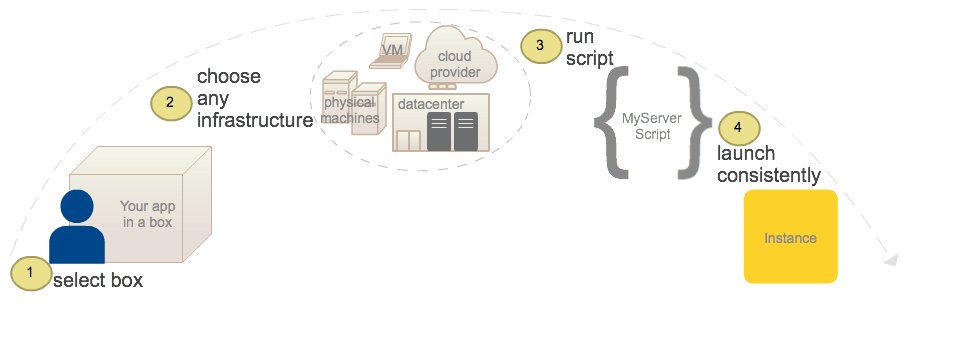

{{{
"title": "Deploying to Any Infrastructure",
"date": "05-14-2019",
"author": "Guillermo Sánchez",
"attachments": [],
"contentIsHTML": false,
"keywords": ["cam", "cloud application manager", "register", "byoi", "bring your own infrastructure"]
}}}

### Deploying to Any Infrastructure

**In this article:**

* [Deploying to Any Infrastructure](#deploying-to-any-infrastructure)
* [Overview](#overview)
* [Audience](#audience)
* [Prerequisites](#prerequisites)
* [Bring your own infrastructure](#bring-your-own-infrastructure)
* [How to Deploy with the Cloud Application Manager Agent](#how-to-deploy-with-the-cloud-application-manager-agent)
* [Cloud Application Manager Agent Command](#cloud-application-manager-agent-command)
* [Contacting Cloud Application Manager Support](#contacting-cloud-application-manager-support)

### Overview

You can bring your own infrastructure to Cloud Application Manager by installing the Cloud Application Manager agent. This will enable lifecycle of the instance through Cloud Application Manager like with any other natively-deployed instance.

### Audience

Cloud Application Manager users willing to register any infrastructure into it.

### Prerequisites

* An active Cloud Application Manager account.
* Any infrastructure capable of running Cloud Application Manager Agent.

### Bring your own infrastructure

You can launch boxes on any infrastructure by running the Cloud Application Manager agent. The agent is required to execute box variables and scripts and run lifecycle operations. To install the agent, you run a Bash command. The infrastructure can be a virtual machine in your laptop, physical machines on premise, a datacenter, or any cloud provider environment. We support running it on Linux distributions Debian 6 and 7, Ubuntu 12.04 and 14.04, RedHat 6.x, CentOS 6.x, and any AWS Linux AMI. No matter where you choose to deploy, boxes launch consistently as they would on any cloud provider.



The preferred method to register any infrastructure in CAM, is to register it into a provider, instead of a stand-alone instance. To learn more about registering your servers to a provider, please review the [Using Compute Instances ](/using-compute-instances.md)

### How to Deploy with the Cloud Application Manager Agent

Run the Cloud Application Manager agent on the Linux machine where you want to launch the box. Once the box is launched, sign in to Cloud Application Manager and access the instance from the Instances to edit its box makeup, debug, or manage its lifecycle. Follow these steps to launch a box on your infrastructure.

#### Before You Begin

* Make sure you have a box configured and ready to launch.
* Get the target infrastructure where you want to launch your box up and running first. This can be any Linux machine running a supported image.

#### Steps

1. SSH into the machine to run the agent. Here as an example, we SSH into a Linux machine running Ubuntu 12.04 in AWS.

   ```
   ssh -i /Users/mrina/Documents/AWS_Private_PublicKeyPairs/AWSEC2_KeyPair/useast-mrina.pem ec2-user@54.163.174.41
   ```

2. Launch an instance of a box using the the Cloud Application Manager agent. In this example, we launch an instance of the public [MongoDB box](https://www.ctl.io/api-docs/cam/#examples-deploy-a-box) in AWS.

   ```
   curl -sSL https://cam.ctl.io | sudo bash -s -- -b "MongoDB Server" -n "test" -V username=admin123 -V password=password12345 -t 314a36ad-74b6-4205-9e33-eac9970e4a1b
   ```

### Cloud Application Manager Agent Command

Use cURL to download and run the agent with piped parameters.

#### Syntax

```
curl -sSL https://cam.ctl.io | sudo bash -s -- -b "<box name or ID>" -n "<environment nameID>" -t <your_authentication_tokenID> -V <variable_name="variable value"ID> [-o "ID<owner IDID>"] [-d] [-H] [h] [f]
```

#### Parameters

| **Parameter**  |  **Description** |
|----------|:-----|
| -b | Specify a box by name or ID. If you give the name, the latest version of the box is launched. If you give the ID that specific version of the box is launched. You can get the ID from the box URL. |
| -n | Give a name to identify the environment where you launch the box, such as dev or test. If you don’t provide one, Cloud Application Manager uses the box name or ID. |
| -t | Enter your [authentication token](../Administering Your Organization/admin-access.md), which you can get from your account in the Cloud Application Manager website. If you run the agent command without this parameter, you’re prompted to enter it later. |
| -V | If a box needs values for certain variables before launching, you can pass each in this format: -V variable_name1=variable_value -V variable_name2=variable_value |
| -o | Optionally, specify in lowercase the box owner ID to tag an instance with this information. You can get the ID when you try to share the box with an owner. The owner can be an account or a workspace. The owner ID is visible within parentheses next to the display name. |
| -d | Optionally, see all the values in each step of the shell script as it executes the box you specified in the target environment. |
| -h| Get help and usage examples with this option. |
| -H | Specify the hostname vanity URL if using the appliance.
| -f | Force the agent to install. If an Cloud Application Manager agent is previously running on the machine, the force flag kills and reinstalls the agent. |

### Contacting Cloud Application Manager Support

We’re sorry you’re having an issue in [Cloud Application Manager](https://www.ctl.io/cloud-application-manager/). Please review the [troubleshooting tips](../Troubleshooting/troubleshooting-tips.md), or contact [Cloud Application Manager support](mailto:incident@CenturyLink.com) with details and screenshots where possible.

For issues related to API calls, send the request body along with details related to the issue.

In the case of a box error, share the box in the workspace that your organization and Cloud Application Manager can access and attach the logs.

* Linux: SSH and locate the log at /var/log/elasticbox/elasticbox-agent.log
* Windows: RDP into the instance to locate the log at ProgramDataElasticBoxLogselasticbox-agent.log
