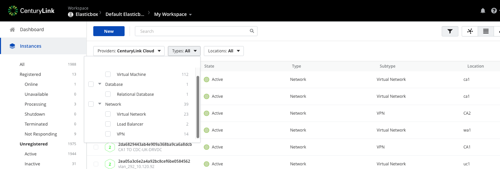
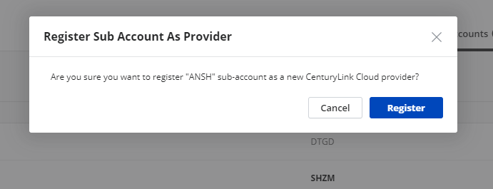
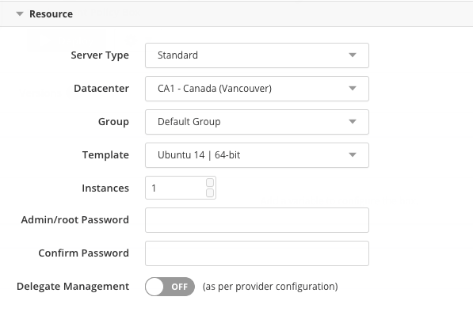
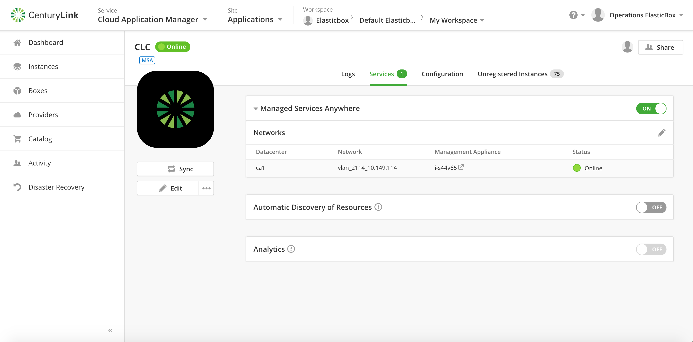

{{{
"title": "Using CenturyLink Cloud",
"date": "08-28-2019",
"author": "Sergio Quintana, and Yongjie Liang",
"keywords": ["cam", "cloud application manager", "centurylink", "clc"],
"attachments": [],
"contentIsHTML": false
}}}

**In this article:**

* [Overview](#overview)
* [Audience](#audience)
* [Prerequisites](#prerequisites)
* [Register CenturyLink Cloud Provider in Cloud Application Manager](#register-centurylink-cloud-provider-in-cloud-application-manager)
* [CenturyLink Cloud Native Resources](#centuryLink-cloud-native-resources)
* [Deploy to CenturyLink Cloud from Cloud Application Manager](#deploy-to-centurylink-cloud-from-cloud-application-manager)
* [Enabling services](#enabling-services)
* [Shutdown and Terminate Instances in CenturyLink Cloud](#shutdown-and-terminate-instances-in-centurylink-cloud)
* [Contacting Cloud Application Manager Support](#contacting-cloud-application-manager-support)

### Overview

Automate application deployments through Cloud Application Manager when you launch to Linux or Windows virtual servers in the CenturyLink Cloud public platform. Cloud Application Manager simplifies deployments with a dedicated focus on applications rather than infrastructure.

### Audience

All Cloud Application Manager users who want to deploy workloads into CLC.

### Prerequisites

* Access to Cloud Application Manager [Management site](https://account.cam.ctl.io/#/providers?type=CenturyLink).
* The user must have an existing CLC account or should be an Administrator of the organization in Cloud Application Manager to create or bring a CLC account to be managed by CenturyLink.

### Register CenturyLink Cloud Provider in Cloud Application Manager

You need a [CenturyLink Cloud account](//www.ctl.io/) to be able to deploy from Cloud Application Manager. When you have an account, follow these steps to register it in Cloud Application Manager to automate your deployments.

**Steps**

1. In Cloud Application Manager, go to **Providers** > **New Provider** and select **CenturyLink.**

2. Enter the CenturyLink username and password as shown

3: Enter a account alias for the CLC sub account you wish to register as or leave empty to use default

4: Save.

   

### CenturyLink Cloud Native Resources

After the synchronization process, you will also find in the Instances page a list of CenturyLink Cloud resources that already exist in your account. You can also register virtual machine type instances from here.

These resources can be filtered by the following types and subtypes:

* **Compute**
  * Vitual Machine
* **Database**
  * Relational Database
* **Network**
  * Virtual Network
  * Load Balancer
  * VPN

### CenturyLink Sub-Accounts 

Also after the synchronization process, you will have the list sub-accounts under this provider account located in the provider page in the sub-accounts section.

You may register a sub account as a provider by selecting the check boxes and using **Bulk Actions** or clicking the down arrow on the right of the sub account.

### Deploy to CenturyLink Cloud from Cloud Application Manager

Select from the following deployment profile options to launch workloads on Linux or Windows machines.

Note a couple of things about instances you deploy on CenturyLink Cloud through Cloud Application Manager.

* Instance name. Each instance is assigned a name that has the format of DatacenterFirst_six_letters_of_instance_nameCounter. i.e., UC1CITTPUBLIC01 for an instance deployed on UC1 (US West - Santa Clara) of a box called Public Proxy.
* Instance Description. Depending on the number of instances you spin up through Cloud Application Manager, each instance is assigned a description that has the format of dasherized-instance-name-datacenter-service_ID-machine-number.

**Deployment**

| Option | Description |
|--------|-------------|
| Provider |  Select a CenturyLink Cloud account registered in Cloud Application Manager. |

**Resource**

| Option | Description |
|--------|-------------|
| Server Type | Select a server type, for example, standard. |
| Datacenter | Select a location to place the instance, for example, UC1. |
| Group |	Select placement group for the new instance. |
| Template | Select from a list of CenturyLink Cloud Linux or Windows images. Images are specific to the box service type, that is, Linux or Windows. |
| Instances | Specify the number of instances to provision. |
| Admin/root Password | Choose the Administrator user password for Windows instance or the root password for Linux instance. This Password can be left empty, then a random password will be generated. When specified, this password will show up in CLC portal. |
| Confirm Password | Confirm the password. |

**Network**

| Option | Description |
|--------|-------------|
| Network |	Select a vLan for the new instance. |
| Public IP	| Check the box to attach a public IP address to the new instance. |

##### Proxy

| Option | Description |
|-------------------|-------------|
| Host |	The hostname or domain of the proxy that the agent will use to connect back to Cloud Application Manager, once it has been installed in the deployed instance. |
| Port |  The port of the proxy that the agent will use to connect back to Cloud Application Manager, once it has been installed in the deployed instance. |

**Compute**

| Option | Description |
|--------|-------------|
| CPUs | Select virtual CPUs for the instance. You can get up to 16 cores. |
| Memory | Allocate RAM for the instance. You can get up to 128 GB. |

**Disks**

By default, the machine is provisioned with 17GB local disk space. You can add more disks in RAW format or Partitioned, up to 1024 GB.

### Enabling services

*Services* tab is the right place where services such as [Managed Services Anywhere](../Managed Services/getting-started-with-cam-enable-managed-provider.md), [Automatic Discovery of Resources](../Getting Started/register-existing-instance.md#discovering-the-unregistered-instances) and [Analytics](../analytics/cloudapplicationmanageranalyticsui.md) can be enabled or disabled attending to your needs. Note that the number of active services will be shown next to the tab's name.

### Shutdown and Terminate Instances in CenturyLink Cloud

**Shutdown Instance**

Initiates a graceful shutdown of the corresponding server or servers. Like the “off” power command, all memory and CPU charges cease, monitors are disabled, and the machine is left in a powered off state. Any licensing charges (if applicable) and storage charges continue accruing.

More information [here](https://www.ctl.io/guides/servers/server-power-operations/).

**Terminate Instance**

The server is terminated and any disks are also deleted. The charges stop.

The history of the instance on Cloud Application Manager is preserved until the instance is deleted.

### Contacting Cloud Application Manager Support

We’re sorry you’re having an issue in [Cloud Application Manager](https://www.ctl.io/cloud-application-manager/). Please review the [troubleshooting tips](../Troubleshooting/troubleshooting-tips.md), or contact [Cloud Application Manager support](mailto:incident@CenturyLink.com) with details and screenshots where possible.

For issues related to API calls, send the request body along with details related to the issue.

In the case of a box error, share the box in the workspace that your organization and Cloud Application Manager can access and attach the logs.
* Linux: SSH and locate the log at /var/log/elasticbox/elasticbox-agent.log
* Windows: RDP into the instance to locate the log at ProgramDataElasticBoxLogselasticbox-agent.log
